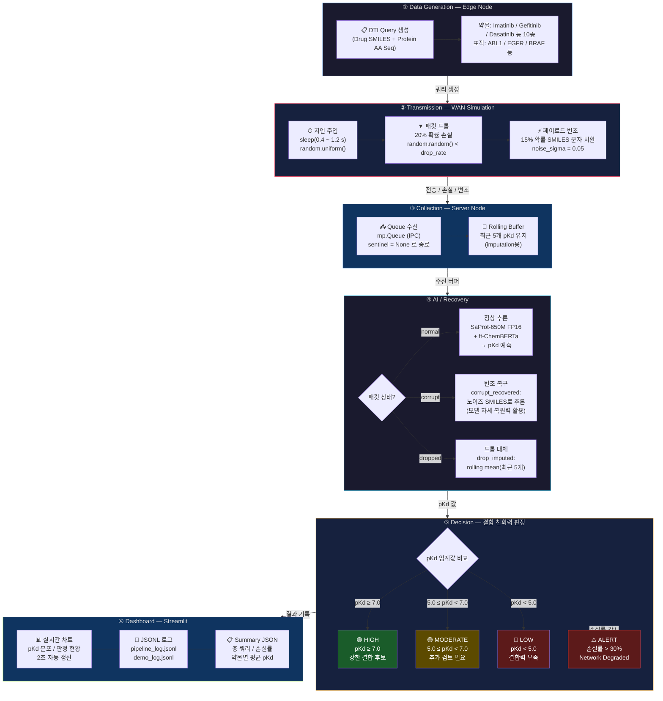

# System Architecture — Bio-AI DTI Query Pipeline

## 6-Step Pipeline Overview

---

## Intentional Network Constraints

| 제약 유형 | 구현 방식 | 파라미터 |
|-----------|-----------|----------|
| **전송 지연** | `time.sleep(random.uniform(lat_min, lat_max))` | 0.4 ~ 1.2 s |
| **패킷 드롭** | `if random.random() < drop_rate: continue` | 20% 기본값 |
| **페이로드 변조** | SMILES 문자 무작위 치환 (C↔N↔O↔S) | 15% / σ=0.05 |

## Recovery Strategy

| 상황 | 복구 방법 |
|------|-----------|
| 정상 패킷 | SaProt-650M + ChemBERTa 직접 추론 |
| 변조 패킷 | 노이즈 SMILES 그대로 추론 (`corrupt_recovered`) |
| 드롭 패킷 | Rolling mean of last 5 pKd values (`drop_imputed`) |
| 추론 실패 | Rolling mean fallback (`imputed`) |

## Tech Stack

| 레이어 | 기술 |
|--------|------|
| 언어 | Python 3.10 |
| AI 모델 | SaProt-650M (FP16), ft-ChemBERTa |
| 파이프라인 | `multiprocessing.Queue` (Edge ↔ Server IPC) |
| 대시보드 | Streamlit |
| 데이터 | BindingDB 80K (pre-train), DAVIS / KIBA (fine-tune) |
| 환경 | conda `bioinfo` |
