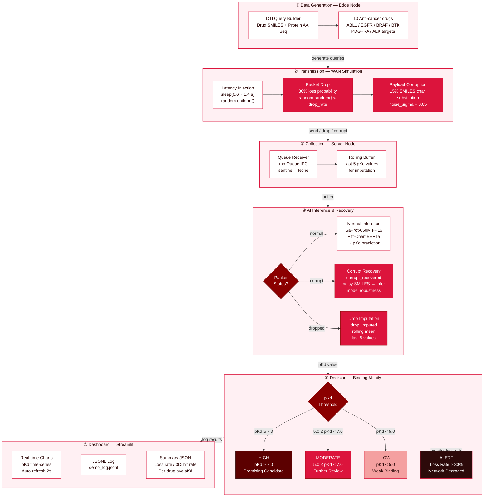

# System Architecture — Bio-AI DTI Query Pipeline

## 6-Step Pipeline Overview

---

## Intentional Network Constraints

| Constraint | Implementation | Parameter |
|------------|---------------|-----------|
| **Latency** | `time.sleep(random.uniform(lat_min, lat_max))` | 0.6 ~ 1.4 s |
| **Packet Drop** | `if random.random() < drop_rate: continue` | 30% (demo) |
| **Payload Corruption** | Random SMILES char substitution (C↔N↔O↔S) | 15% / σ=0.05 |

## Recovery Strategy

| Situation | Recovery Method | Log Path |
|-----------|----------------|----------|
| Normal packet | SaProt-650M + ChemBERTa direct inference | `normal` |
| Corrupted payload | Infer with noisy SMILES — model robustness | `corrupt_recovered` |
| Dropped packet | Rolling mean of last 5 pKd values | `drop_imputed` |
| Inference failure | Rolling mean fallback | `imputed` |

## Tech Stack

| Layer | Technology |
|-------|-----------|
| Language | Python 3.10 |
| Protein Encoder | SaProt-650M-AF2 (FP16, frozen) + FoldSeek 3Di tokens |
| Drug Encoder | ft-ChemBERTa (seyonec/ChemBERTa-zinc-base-v1, layers 4~5) |
| Regression Head | MLP [1280+768 → 512 → 256 → 64 → 1] |
| Pipeline IPC | `multiprocessing.Queue` + `mp.Event` |
| Dashboard | Streamlit (auto-refresh 2s) |
| Training Data | BindingDB 80K → DAVIS 30K → KIBA 118K |
| Environment | conda `bioinfo` |

## Experiment Results (Final)

| Metric | Value |
|--------|-------|
| Zero Silent Drop | **50 / 50 (100%)** |
| Corrupt Recovery Accuracy | **3 / 3 (100%)** |
| Drop Recovery Accuracy | **9 / 17 (52.9%)** |
| 3Di Token Hit Rate | **33 / 33 (100%)** |
| Network Alert | **Triggered (34% > 30%)** |
| AI Inference Failure | **0 / 33 (0%)** |
| Avg pKd | **6.5469** |
